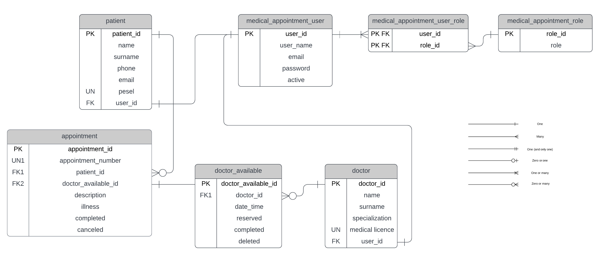
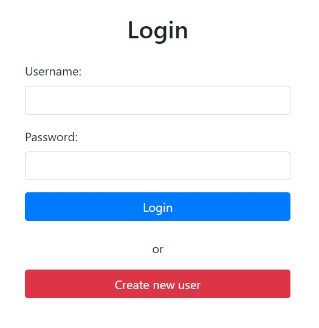
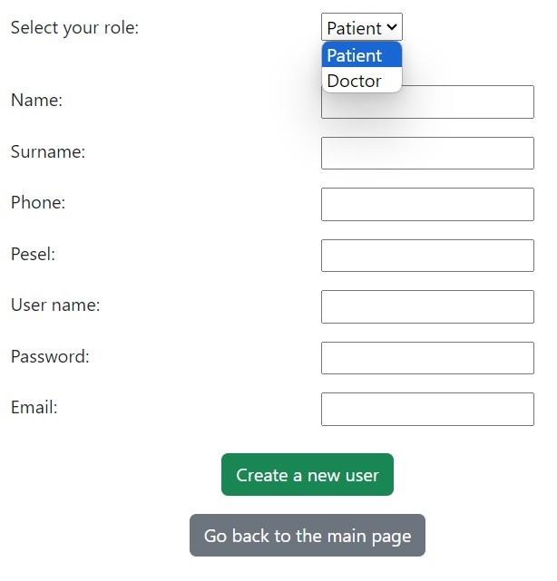
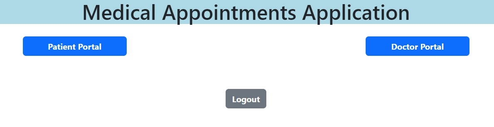
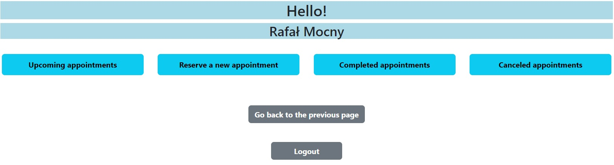
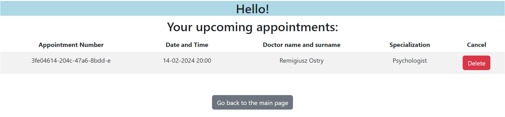
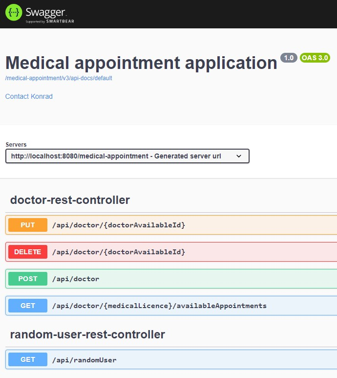

# Medical Appointment App

_An application for patients and doctors.   
It allows for creating doctors' available dates and confirming them by adding notes and describing illnesses.  
Moreover, the app permits to schedule appointment, cancelling reservations and checking upcoming, canceled and completed appointments._

## Table of Contents
* [Technologies Used](#technologies-used)
* [Features](#features)
* [ERD Diagram](#erd-diagram)
* [Screenshots](#screenshots)
* [Tests](#tests)
* [Rest API](#rest-api)
* [Setup](#setup)
* [Usage](#usage)
* [Project Status](#project-status)
* [Room for Improvement](#room-for-improvement)
* [Contact](#contact)

## Technologies Used
- Spring Boot - version 3.2.1
- SpringDoc OpenAPI Starter WebMVC UI - version 2.3.0
- Bootstrap - version 5.2.2
- Wiremock - version 3.0.1
- Rest Assured - version 5.4.0
- Swagger Annotations - version 1.6.13
- Mapstruct - version 1.5.5.Final
- Lombok, Logback, JUnit, Mockito, Flyway, Hibernate
- Postgresql
- Thymeleaf
- Docker

## Features
* Security:
    - login or creating new user
* Patient:
    - Schedule appointment
    - Display available doctor specialization
    - Checking patients' upcoming, canceled and completed appointments
    - Checking description connected with completed appointment
    - Cancel reservation
* Doctor:
    - Adding and canceling term of appointment
    - Checking reserved appointment
    - Checking patients' illness history
    - Adding notes and describing illnesses to the appointment

## ERD Diagram

## Screenshots

| 

 |
|---|
| 
<b>Login screen</b>
 |

| 

 |
|---|
| 
<b>Create New User</b>
 |

| 

 |
|---|
| 
<b>Home page</b>
 |

| 

 |
|---|
| 
<b>Patient portal</b>
 |

| 

 |
|---|
| 
<b>Upcoming appointments</b>
 |

## Tests
It has been prepared tests covering **more than 80 %** of the code lines.

The following types of tests have been prepared:
- Unit tests (Mockito)
- DataJpaTest
- WebMvcTest
- SpringBootTest
- RestAssured
- Wiremock

## Rest API
There is a prepared REST API which includes GET, POST, PUT, and DELETE endpoints.  
It allows users to manage available appointments for doctors.  
Moreover, it consumes  external api - random-data-api.com

## Setup
What are the project requirements/dependencies? Where are they listed? A requirements.txt or a Pipfile.lock file perhaps? Where is it located?

Proceed to describe how to install / setup one's local environment / get started with the project.

## Usage
How does one go about using it?
Provide various use cases and code examples here.

`write-your-code-here`

## Project Status
Project is: _complete_

## Room for Improvement
Include areas you believe need improvement / could be improved. Also add TODOs for future development.

Room for improvement:
- Improving the visual aspects of the application 
- Patients' ability to add opinion after appointment 

## Contact
Created by [@konradoCh](chochorowski.konrad@gmail.com) 
